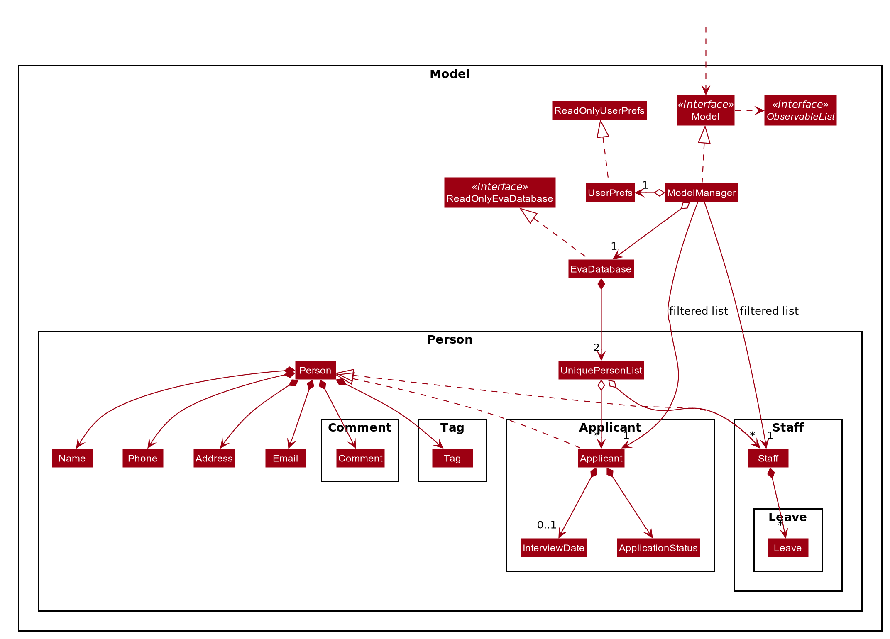
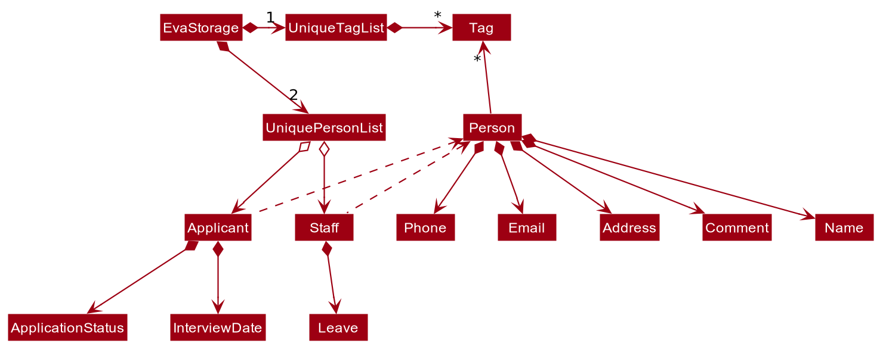
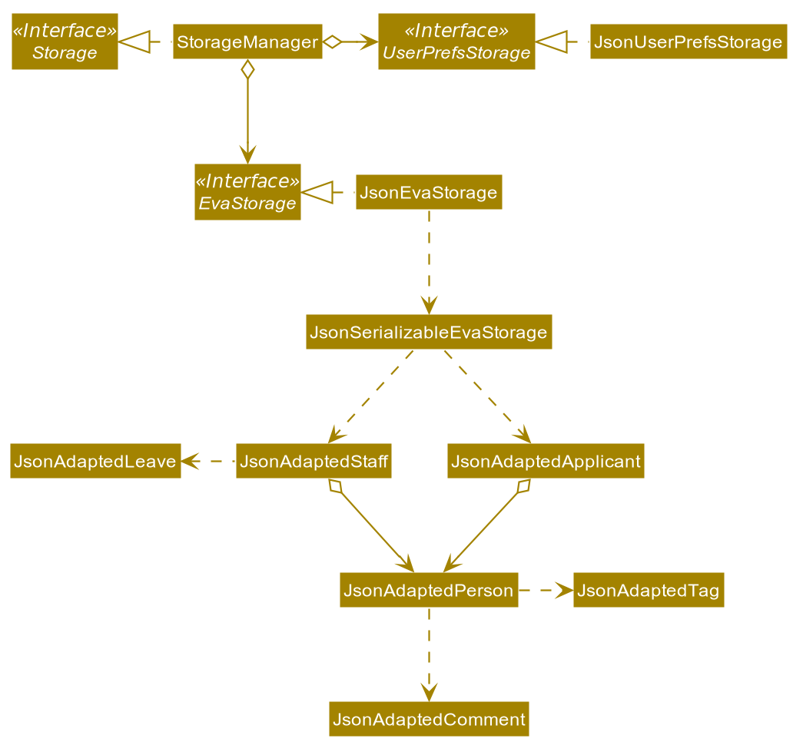
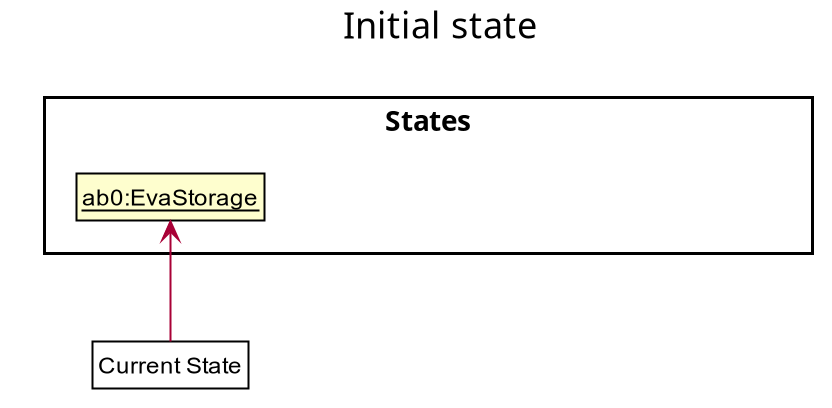
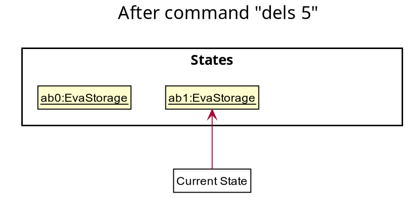
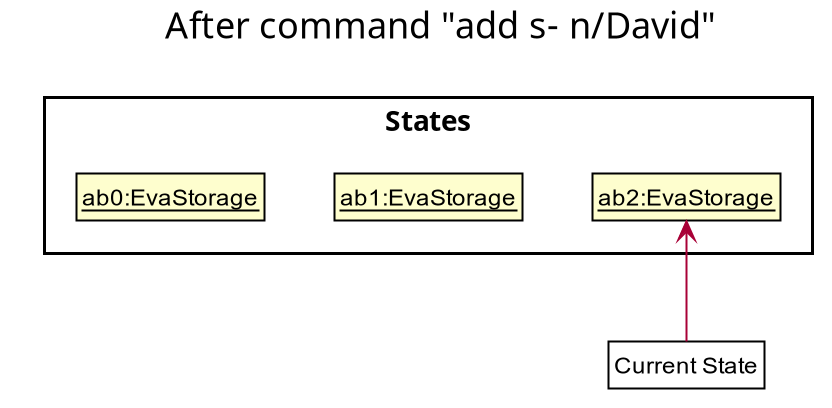
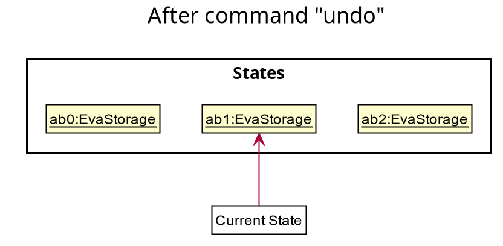
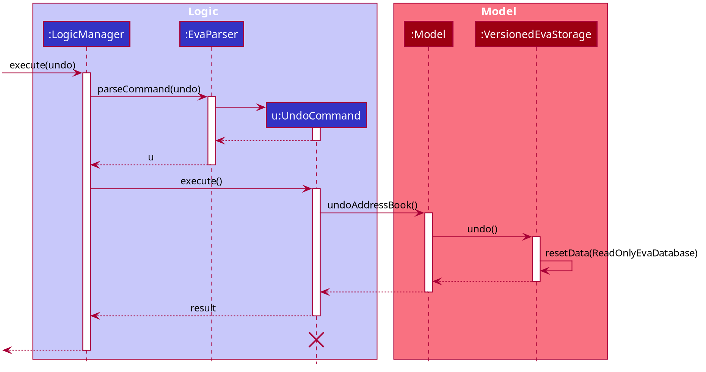
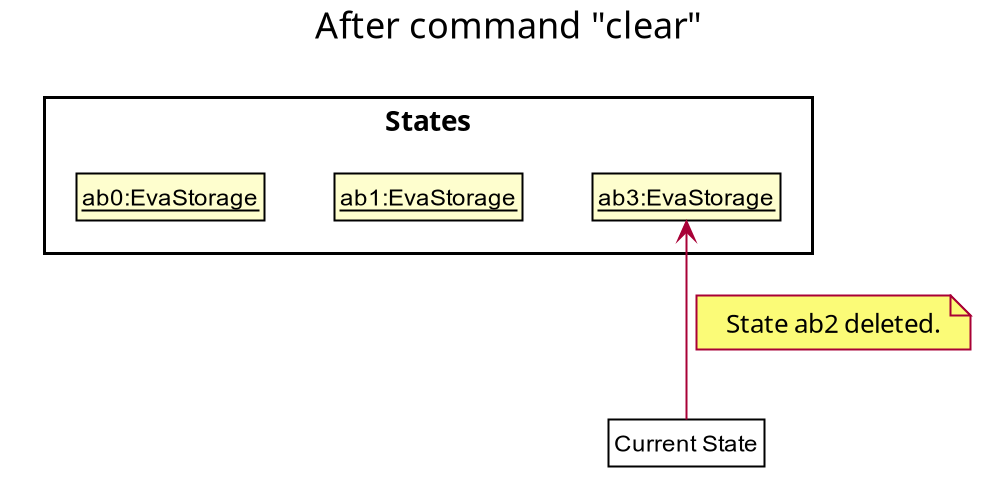
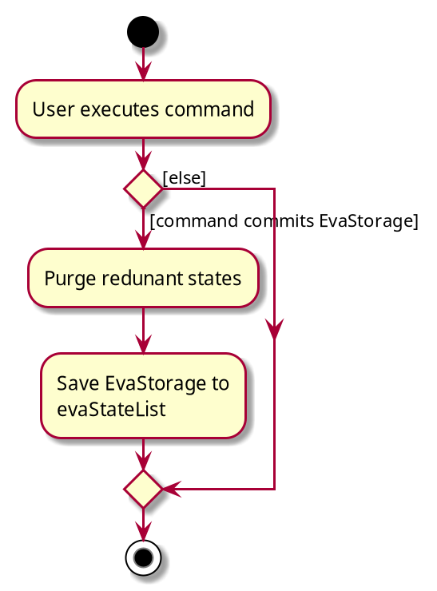

* Table of Contents
{:toc}

--------------------------------------------------------------------------------------------------------------------

## **1. Setting up, getting started**

Refer to the guide [_Setting up and getting started_](SettingUp.md).

--------------------------------------------------------------------------------------------------------------------

## **2. Design**

:bulb: **Tip:** The `.puml` files used to create diagrams in this document can be found in the [diagrams](https://github.com/AY2021S1-CS2103T-W13-1/tp/tree/master/docs/diagrams/) folder. Refer to the [_PlantUML Tutorial_ at se-edu/guides](https://se-education.org/guides/tutorials/plantUml.html) to learn how to create and edit diagrams.

### 2.1 Architecture

The ***Architecture Diagram*** given above explains the high-level design of the App. 
Given below is a quick overview of each component.

**`Main`** has two classes called [`Main`](https://github.com/AY2021S1-CS2103T-W13-1/tp/tree/master/src/main/java/com/eva/Main.java) and [`MainApp`](https://github.com/AY2021S1-CS2103T-W13-1/tp/tree/master/src/main/java/com/eva/MainApp.java). It is responsible for,
* At app launch: Initializes the components in the correct sequence, and connects them up with each other.
* At shut down: Shuts down the components and invokes cleanup methods where necessary.

[**`Commons`**](#common-classes) represents a collection of classes used by multiple other components.

The rest of the App consists of four main components.

* [**`UI`**](#ui-component): The UI of the App.
* [**`Logic`**](#logic-component): The command parser and executor.
* [**`Model`**](#model-component): Holds the data of the App in memory.
* [**`Storage`**](#storage-component): Reads data from, and writes data to, the hard disk.

Each of the four components,

* defines its *API* in an `interface` with the same name as the Component.
* exposes its functionality using a concrete `{Component Name}Manager` class (which implements the corresponding API `interface` mentioned in the previous point.

For example, the `Logic` component (see the class diagram given below) defines its API in the `Logic.java` interface and exposes its functionality using the `LogicManager.java` class which implements the `Logic` interface.

**How the architecture components interact with each other**

The *Sequence Diagram* below shows how the components interact with each other for the scenario where the user issues the command `delete 1`.

The sections below give more details of each component.

### 2.1.1 UI component

**API** :
[`Ui.java`](https://github.com/AY2021S1-CS2103T-W13-1/tp/tree/master/src/main/java/com/eva/ui/Ui.java)

The UI consists of a `MainWindow` that is made up of parts e.g.`CommandBox`, `ResultDisplay`, `PersonListPanel`, `StatusBarFooter` etc. All these, including the `MainWindow`, inherit from the abstract `UiPart` class.

The `UI` component uses JavaFx UI framework. The layout of these UI parts are defined in matching `.fxml` files that are in the `src/main/resources/view` folder. For example, the layout of the [`MainWindow`](https://github.com/AY2021S1-CS2103T-W13-1/tp/tree/master/src/main/java/com/eva/ui/MainWindow.java) is specified in [`MainWindow.fxml`](https://github.com/AY2021S1-CS2103T-W13-1/tp/tree/master/src/main/resources/view/MainWindow.fxml)

The `UI` component,

* Executes user commands using the `Logic` component.
* Listens for changes to `Model` data so that the UI can be updated with the modified data.

### 2.1.2 Logic component

**API** :
[`Logic.java`](https://github.com/AY2021S1-CS2103T-W13-1/tp/tree/master/src/main/java/com/eva/logic/Logic.java)

1. `Logic` uses the `EvaParser` class to parse the user command.
1. This results in a `Command` object which is executed by the `LogicManager`.
1. The command execution can affect the `Model` (e.g. adding a staff).
1. The result of the command execution is encapsulated as a `CommandResult` object which is passed back to the `Ui`.
1. In addition, the `CommandResult` object can also instruct the `Ui` to perform certain actions, such as displaying help to the user.

Given below is the Sequence Diagram for interactions within the `Logic` component for the `execute("delstaff 1")` API call.

:information_source: **Note:** The lifeline for `DeleteCommandParser` should end at the destroy marker (X) but due to a limitation of PlantUML, the lifeline reaches the end of diagram.

### 2.1.3 Model component

**API** : [`Model.java`](https://github.com/AY2021S1-CS2103T-W13-1/tp/tree/master/src/main/java/com/eva/model/Model.java)

The `Model`,

* stores a `UserPref` object that represents the user’s preferences.
* stores the staff and applicant data.
* exposes an unmodifiable `ObservableList<Staff>` and an `ObservableList<Applicant>` that can be 'observed' e.g. the UI can be bound to this list so that the UI automatically updates when the data in the list change.
* does not depend on any of the other three components.

:information_source: **Note:** An alternative (arguably, a more OOP) model is given below. It has a `Tag` list in the `EvaStorage`, which `Person` references. This allows `AddressBook` to only require one `Tag` object per unique `Tag`, instead of each `Person` needing their own `Tag` object. 

### 2.1.4 Storage component

**API** : [`Storage.java`](https://github.com/AY2021S1-CS2103T-W13-1/tp/tree/master/src/main/java/com/eva/storage/Storage.java)

The `Storage` component,
* can save `UserPref` objects in json format and read it back.
* can save the Eva staff and applicant data in json format and read it back.

### 2.1.5 Common classes

Classes used by multiple components are in the `com.eva.commons` package.

--------------------------------------------------------------------------------------------------------------------

## **3. Implementation**

This section describes some noteworthy details on how certain features are implemented.

### 3.1 Staff Management System

#### 3.1.1 Leave System

The proposed undo/redo mechanism is facilitated by `VersionedAddressBook`. It extends `AddressBook` with an undo/redo history, stored internally as an `addressBookStateList` and `currentStatePointer`. Additionally, it implements the following operations:

* `VersionedAddressBook#commit()` — Saves the current eva database state in its history.
* `VersionedAddressBook#undo()` — Restores the previous eva database state from its history.
* `VersionedAddressBook#redo()` — Restores a previously undone eva database state from its history.

These operations are exposed in the `Model` interface as `Model#commitAddressBook()`, `Model#undoAddressBook()` and `Model#redoAddressBook()` respectively.

Given below is an example usage scenario and how the undo/redo mechanism behaves at each step.

Step 1. The user launches the application for the first time. The `VersionedAddressBook` will be initialized with the initial eva database state, and the `currentStatePointer` pointing to that single eva database state.

Step 2. The user executes `delete 5` command to delete the 5th person in the eva database. The `delete` command calls `Model#commitAddressBook()`, causing the modified state of the eva database after the `delete 5` command executes to be saved in the `addressBookStateList`, and the `currentStatePointer` is shifted to the newly inserted eva database state.

Step 3. The user executes `add n/David …​` to add a new person. The `add` command also calls `Model#commitAddressBook()`, causing another modified eva database state to be saved into the `addressBookStateList`.

:information_source: **Note:** If a command fails its execution, it will not call `Model#commitAddressBook()`, so the eva database state will not be saved into the `addressBookStateList`.

Step 4. The user now decides that adding the person was a mistake, and decides to undo that action by executing the `undo` command. The `undo` command will call `Model#undoAddressBook()`, which will shift the `currentStatePointer` once to the left, pointing it to the previous eva database state, and restores the eva database to that state.

:information_source: **Note:** If the `currentStatePointer` is at index 0, pointing to the initial AddressBook state, then there are no previous AddressBook states to restore. The `undo` command uses `Model#canUndoAddressBook()` to check if this is the case. If so, it will return an error to the user rather
than attempting to perform the undo.

The following sequence diagram shows how the undo operation works:

:information_source: **Note:** The lifeline for `UndoCommand` should end at the destroy marker (X) but due to a limitation of PlantUML, the lifeline reaches the end of diagram.

The `redo` command does the opposite — it calls `Model#redoAddressBook()`, which shifts the `currentStatePointer` once to the right, pointing to the previously undone state, and restores the eva database to that state.

:information_source: **Note:** If the `currentStatePointer` is at index `addressBookStateList.size() - 1`, pointing to the latest eva database state, then there are no undone AddressBook states to restore. The `redo` command uses `Model#canRedoAddressBook()` to check if this is the case. If so, it will return an error to the user rather than attempting to perform the redo.

Step 5. The user then decides to execute the command `list`. Commands that do not modify the eva database, such as `list`, will usually not call `Model#commitAddressBook()`, `Model#undoAddressBook()` or `Model#redoAddressBook()`. Thus, the `addressBookStateList` remains unchanged.

Step 6. The user executes `clear`, which calls `Model#commitAddressBook()`. Since the `currentStatePointer` is not pointing at the end of the `addressBookStateList`, all eva database states after the `currentStatePointer` will be purged. Reason: It no longer makes sense to redo the `add n/David …​` command. This is the behavior that most modern desktop applications follow.

The following activity diagram summarizes what happens when a user executes a new command:

#### 3.1.2 Design consideration:

##### Aspect: How undo & redo executes

* **Alternative 1 (current choice):** Saves the entire eva database.
  * Pros: Easy to implement.
  * Cons: May have performance issues in terms of memory usage.

* **Alternative 2:** Individual command knows how to undo/redo by
  itself.
  * Pros: Will use less memory (e.g. for `delete`, just save the person being deleted).
  * Cons: We must ensure that the implementation of each individual command are correct.
  
### 3.2. Applicant Management System

Nikhila to update

#### 3.2.1 Application System:

Royce to update

#### 3.2.2 Design consideration:

##### Aspect: How undo & redo executes

* **Alternative 1 (current choice):** Saves the entire eva database.
  * Pros: Easy to implement.
  * Cons: May have performance issues in terms of memory usage.

* **Alternative 2:** Individual command knows how to undo/redo by
  itself.
  * Pros: Will use less memory (e.g. for `delete`, just save the person being deleted).
  * Cons: We must ensure that the implementation of each individual command are correct.

### 3.2. Panels (List/Profile) display

Ben to update

_{more aspects and alternatives to be added}_

--------------------------------------------------------------------------------------------------------------------

## **4. Documentation, logging, testing, configuration, dev-ops**

* [Documentation guide](Documentation.md)
* [Testing guide](Testing.md)
* [Logging guide](Logging.md)
* [Configuration guide](Configuration.md)
* [DevOps guide](DevOps.md)

--------------------------------------------------------------------------------------------------------------------

## **5. Appendix: Requirements**

### 5.1 Product scope

**Target user profile**:

* works in small business/startup (5-30 headcount)
* can type fast
* prefers desktop apps over other types of apps
* prefers typing inputs compared to mouse interactions
* is reasonably comfortable using CLI apps

**Value proposition**: Simple and lightweight application that handles HR related administrative tasks, like manage staff performance and recruitment applicants, faster than a typical mouse/GUI driven app.

### 5.3 User stories

Priorities: High (must have) - `* * *`, Medium (nice to have) - `* *`, Low (unlikely to have) - `*`

| Priority | As a …​                                    | I want to …​                     | So that I can…​                                                        |
| -------- | ------------------------------------------ | ------------------------------   | ---------------------------------------------------------------------- |
| `* * *`  | first timer                                | be able to use software straight away without configuring complex settings |                              |
| `* * *`  | HR manager                                 | store information about all the staff in my company like their role, designation and their project team name, etc.|   |
| `* * *`  | Director of Human Resources                | I want to have quick and easy access to all HR information|                                               |
| `* * *`  | organised HR manager                       | add data of applicants           | have these data at one place in a neat manner                          |
| `* *`    | organised HR manager                       | delete data of applicants        | have these data at one place in a neat manner                          |
| `* *`    | busy HR staff with a lot of things to do  |  know my interview appointments with the applicants quickly| I will not forget any such appointments and attend necessary interviews |
| `* *`    | HR manager                                 | easily keep track of applicant’s application status |clear understanding of the recruitment process at any given point of time |
 
### 5.3 Use cases

(For all use cases below, the **System** is the `Eva` and the **Actor** is the `user`, unless specified otherwise)
(Optional fields are given in square bracket e.g \[t/TAG\])

***Use case: UC01 - Adding a Record of staff***

**MSS**

1.  User types in `adds n/NAME p/PHONE_NUMBER e/EMAIL a/ADDRESS [t/TAG]…[c/COMMENTS]…`
2.  Eva adds in the staff record
3.  Eva displays the staff record added to User
    Use case ends.

**Extensions**

* 1a. Eva detects missing fields

    * 1a1. Eva shows the correct format to key in data.
    * 1a2. Eva requests the user to add in data again.
    * 1a3  User enters new data.

    Steps 1a1-1a3 are repeated until the data entered are correct.
    Use case resumes from step 2.

* 1b. Eva detects invalid email, phone number or comment.

    * 1b1. Eva shows the valid format to key in the relevant field.
    * 1b2. Eva requests the user to add in data again.
    * 1b3. User enters new data.

    Steps 1b1-1b3 are repeated until the data entered are correct.
    Use case resumes from step 2.

***Use case: UC02 - Deleting a Record of staff***

**MSS**

1. User types in `dels INDEX`. 
2. Eva deletes the staff record permanently.
3. Eva displays the confirmed message of deletion of that staff record.  
    Use case ends.

**Extensions**

* 1a. Eva does not find staff record with the keyed in index.

    * 1a1. Eva informs the user that there are no such records.
    * 1a2. Eva requests the user to type the command in again. 
    * 1a3  User types in `dels INDEX` with correct index of staff
    Steps 1a1-1a3 are repeated until the data entered are correct.
    Use case resumes from step 2.

* 1b. Eva does not detect any input for <index>.

    * 1b1. Eva requests the user to type the command in again. 
    * 1b2. User types in the new command `dels INDEX`.    
    Steps 1b1-1b3 are repeated until the data entered are correct.
    Use case resumes from step 2.

***Use Case UC03 - Edit a Record of staff***

**MSS**

1. User navigates to staff list by command 'list s-' or to staff profile while being on staff list via 'view INDEX'
2. Eva shows a list of staffs with indexes beside each staff
3. User types in edits INDEX [n/NAME] [a/ADDRESS] [e/EMAIL] [p/PHONE] [c/COMMENT] [id/INTERVIEW_DATE] to edit staff at INDEX
4. Eva updates the staff record according to input information.
5. Eva displays the confirmed message of editing of staff record.
    Use case end.

**Extensions**

* 3a. Eva does not detect any input for index.

    * 3a1. Eva requests the user to type the command in again with an index.  
    * 3a2. User types in the new edit command.    
    Steps 3a1-3a2 are repeated until the data entered are correct.
    Use case resumes from step 4.
    
* 3b. Eva does not detect any fields in input.

    * 3b1. Eva requests the user to type the command in again with at least one field.  
    * 3b2. User types in the new edit command.    
    Steps 3b1-3b2 are repeated until the data entered are correct.
    Use case resumes from step 4.
    
* 3c. Eva detects that user is in a staff profile and input index does not match staff index.

    * 3c1. Eva requests the user to type the command in again with the index of the staff whose profile is being viewed.  
    * 3c2. User types in the new edit command.    
    Steps 3c1-3c2 are repeated until the data entered are correct.
    Use case resumes from step 4.

***Use case: UC04 - Adding a Comment on staff***

**MSS**

1. User navigates to staff list by command 'list s-' or to staff profile while being on staff list via 'view INDEX'
2. Eva shows a list of staffs with indexes beside each staff
3. User types in `addc INDEX c/ ti/TITLE d/DATE desc/DESCRIPTION`. 
4. Eva adds the comment to staff record permanently.
5. Eva displays the confirmed message of addition of comment to that staff record.  
    Use case ends.

**Extensions**

* 3a. Eva does not find staff record with the keyed in index.

    * 3a1. Eva informs the user that there are no such records.
    * 3a2. Eva requests the user to type the command in again. 
    * 3a3  User types in `addc INDEX c/ ti/TITLE d/Date desc/DESCRIPTION` with correct index of staff
    Steps 3a1-3a3 are repeated until the data entered are correct.
    Use case resumes from step 4.

* 3b. Eva does not detect any input for index.

    * 3b1. Eva requests the user to type the command in again. 
    * 3b2. User types in the new command `addc INDEX c/ ti/TITLE d/Date desc/DESCRIPTION`.    
    Steps 3b1-3b3 are repeated until the data entered are correct.
    Use case resumes from step 4.
    
* 3c. Eva detects missing fields

    * 3c1. Eva shows the correct format to key in data.
    * 3c2. Eva requests the user to add in data again.
    * 3c3  User enters new data.

    Steps 3c1-3c3 are repeated until the data entered are correct.
    Use case resumes from step 4.
    
* 3d. Eva detects that user is in a staff profile and input index does not match staff index.

    * 3d1. Eva requests the user to type the command in again with the index of the staff whose profile is being viewed.  
    * 3d2. User types in the new add comment command.    
    Steps 3d1-3d2 are repeated until the data entered are correct.
    Use case resumes from step 4.
    

***Use case: UC05 - Deleting a Comment on staff***

**MSS**

1. User navigates to staff list by command 'list s-' or to staff profile while being on staff list via 'view INDEX'
2. Eva shows a list of staffs with indexes beside each staff
3. User types in `delete INDEX c/ ti/TITLE_TO_DELETE`. 
4. Eva deletes the comment with entered `TITLE_TO_DELETE` from staff record permanently.
5. Eva displays the confirmed message of deletion of comment from staff record.  
    Use case ends.

**Extensions**

* 3a. Eva does not find staff record with the keyed in index.

    * 3a1. Eva informs the user that there are no such records.
    * 3a2. Eva requests the user to type the command in again. 
    * 3a3  User types in `delete INDEX c/ ti/TITLE_TO_DELETE` with correct index of staff
    Steps 3a1-3a3 are repeated until the data entered are correct.
    Use case resumes from step 4.

* 3b. Eva does not detect any input for index.

    * 3b1. Eva requests the user to type the command in again. 
    * 3b2. User types in the new command `delete INDEX c/ ti/TITLE_TO_DELETE`.    
    Steps 3b1-3b2 are repeated until the data entered are correct.
    Use case resumes from step 4.
    
* 3c. Eva detects missing fields

    * 3c1. Eva shows the correct format to key in data.
    * 3c2. Eva requests the user to add in data again.
    * 3c3  User enters new data.

    Steps 3c1-3c3 are repeated until the data entered are correct.
    Use case resumes from step 4.
    
* 3d. Eva detects that user is in a staff profile and input index does not match staff index.

    * 3d1. Eva requests the user to type the command in again with the index of the staff whose profile is being viewed.  
    * 3d2. User types in the new delete comment command.    
    Steps 3d1-3d2 are repeated until the data entered are correct.
    Use case resumes from step 4.

***Use case: UC06 - Editing a Comment on staff***

**MSS**

1. User navigates to staff list by command 'list s-' or to staff profile while being on staff list via 'view INDEX'
2. Eva shows a list of staffs with indexes beside each staff
3. User types in `editc INDEX c/ ti/TITLE_OF_COMMENT_TO_CHANGE d/DATE_OF_COMMENT_TO_CHANGE desc/NEW_DESCRIPTION`. 
4. Eva edits the comment to staff record permanently.
5. Eva displays the confirmed message of edition of comment to that staff record.  
    Use case ends.

**Extensions**

* 3a. Eva does not find staff record with the keyed in index.

    * 3a1. Eva informs the user that there are no such records.
    * 3a2. Eva requests the user to type the command in again. 
    * 3a3  User types in `editc INDEX c/ ti/TITLE_OF_COMMENT_TO_CHANGE d/DATE_OF_COMMENT_TO_CHANGE desc/NEW_DESCRIPTION` with correct index of staff
    Steps 3a1-3a3 are repeated until the data entered are correct.
    Use case resumes from step 4.

* 3b. Eva does not detect any input for index.

    * 3b1. Eva requests the user to type the command in again. 
    * 3b2. User types in the new command `editc INDEX c/ ti/TITLE_OF_COMMENT_TO_CHANGE d/DATE_OF_COMMENT_TO_CHANGE desc/NEW_DESCRIPTION`.    
    Steps 3b1-3b3 are repeated until the data entered are correct.
    Use case resumes from step 4.
    
* 3c. Eva detects missing fields

    * 3c1. Eva shows the correct format to key in data.
    * 3c2. Eva requests the user to add in data again.
    * 3c3  User enters new data.

    Steps 3c1-3c3 are repeated until the data entered are correct.
    Use case resumes from step 4.
    
* 3d. Eva detects that user is in a staff profile and input index does not match staff index.

    * 3d1. Eva requests the user to type the command in again with the index of the staff whose profile is being viewed.  
    * 3d2. User types in the new edit comment command.    
    Steps 3d1-3d2 are repeated until the data entered are correct.
    Use case resumes from step 4.
    

***Use case: UC07 - Adding a leave record to staff***

**MSS**

1.  User types in `addleave <index> l/d/DATE [d/DATE]`
2.  Eva adds in the leave to staff record based on index
3.  Eva displays the updated staff to User
    Use case ends.

**Extensions**

* 1a. Eva detects missing fields or more fields than expected.

    * 1a1. Eva shows the correct format to key in data.
    * 1a2. Eva requests the user to add in data again.
    * 1a3  User enters new data.

    Steps 1a1-1a3 are repeated until the data entered are correct.
    Use case resumes from step 2.

* 1b. Eva detects invalid date.

    * 1b1. Eva shows the valid format to key in the relevant field.
    * 1b2. Eva requests the user to add in data again.
    * 1b3. User enters new data.

    Steps 1b1-1b3 are repeated until the data entered are correct.
    Use case resumes from step 2.
    
* 1c. Eva detects conflict in leave dates within the specified staff record.

    * 1a1. Eva informs the user that there are conflicting records.
    * 1a2. Eva requests the user to type the command in again. 
    * 1a3  User types in a new leave date.
    Steps 1a1-1a3 are repeated until the data entered are correct.
    Use case resumes from step 2.

***Use case: UC08 - Deleting a leave record from staff***

**MSS**

1.  User types in `deleteleave <index> d/DATE`
2.  Eva deletes the leave containing specified date from index specified staff record
3.  Eva displays the updated staff to User
    Use case ends.

**Extensions**

* 1a. Eva detects missing fields or more fields than expected.

    * 1a1. Eva shows the correct format to key in command.
    * 1a2. Eva requests the user to add in data again.
    * 1a3  User enters new data.

    Steps 1a1-1a3 are repeated until the data entered are correct.
    Use case resumes from step 2.

* 1b. Eva detects invalid date.

    * 1b1. Eva shows the valid format to key in the relevant field.
    * 1b2. Eva requests the user to add in command again.
    * 1b3. User enters new command.

    Steps 1b1-1b3 are repeated until the command entered is correct.
    Use case resumes from step 2.
    
* 1c. Eva detects no leave in index specified staff record containing specified date.

    * 1a1. Eva informs the user that there are no exiting leave records containing specified date.
    * 1a2. Eva requests the user to type the command in again. 
    * 1a3  User types in a new leave date.
    Steps 1a1-1a3 are repeated until the data entered are correct.
    Use case resumes from step 2.

***Use case: UC09 - Adding a record of applicant***

**MSS**

1.  User types in addapplicant n/<applicant_name> e/<email> p/<phoneno> a/<address> id/22/11/2020 
2.  Eva adds in the applicant record
3.  Eva displays the applicant record added to User
    Use case ends.

**Extensions**

* 1a. Eva detects missing compulsory fields (name, email, address, phone)

    * 1a1. Eva shows the correct format to key in data.
    * 1a2. Eva requests the user to add in data again.
    * 1a3  User enters new data.

    Steps 1a1-1a3 are repeated until the data entered are correct.
    Use case resumes from step 2.

* 1b. Eva detects invalid email, phone number or interview date.

    * 1b1. Eva shows the valid format to key in the relevant field.
    * 1b2. Eva requests the user to add in data again.
    * 1b3. User enters new data.

    Steps 1b1-1b3 are repeated until the data entered are correct.
    Use case resumes from step 2.
    
***Use case: UC10 - Deleting a Record of Applicant***

**MSS**

1. User navigates to applicant list by command 'list -applicants'.
2. Eva shows a list of applicants with indexes beside each applicant. 
3. User types in delapplicant INDEX.
4. Eva deletes the applicant record and all related information permanently.
5. Eva displays the confirmed message of deletion of that applicant record.  
    Use case ends.

**Extensions**

* 2a. Eva does not have any applicant records.

    * 2a1. Eva shows error message if user types delapplication 1 as there are no applciant records.
    Use case ends.

* 3a. Eva does not detect any input for index.

    * 3b1. Eva requests the user to type the command in again in the correct format.  
    * 3b2. User types in the new applicant_name of delete 1.    
    Steps 3b1-3b2 are repeated until the data entered are correct.
    Use case resumes from step 4.
    
***Use Case UC11 - Edit a Record of applicant***

**MSS**

1. User navigates to applicant list by command 'list a-' or to applicant profile while being on applicant list via 'view INDEX'
2. Eva shows a list of applicants with indexes beside each applicant
3. User types in edita INDEX [n/NAME] [a/ADDRESS] [e/EMAIL] [p/PHONE] [c/COMMENT] [id/INTERVIEW_DATE] to edit applicant at INDEX
4. Eva updates the applicant record according to input information.
5. Eva displays the confirmed message of editing of applicant record.
    Use case end.

**Extensions**

* 3a. Eva does not detect any input for index.

    * 3a1. Eva requests the user to type the command in again in the correct format.  
    * 3a2. User types in the new edit command.    
    Steps 3a1-3a2 are repeated until the data entered are correct.
    Use case resumes from step 4.
    
* 3b. Eva does not detect any fields in input.

    * 3b1. Eva requests the user to type the command in again with at least one field.  
    * 3b2. User types in the new edit command.    
    Steps 3b1-3b2 are repeated until the data entered are correct.
    Use case resumes from step 4.
    
* 3c. Eva detects that user is in a applicant profile and input index does not match applicant index.

    * 3c1. Eva requests the user to type the command in again with the index of the applicant whose profile is being viewed.  
    * 3c2. User types in the new edit command.    
    Steps 3c1-3c2 are repeated until the data entered are correct.
    Use case resumes from step 4.

***Use Case UC12 - Set the application status of an applicant***

**MSS**
1. User types in setappstatus 1 as/<appstatus>
2. Eva shows all matched staff records to the <applicant_name> with indexes beside.
3. User types in the index to delete
4. Eva deletes the applicant record and all related information permanently.
5. Eva displays the confirmed message of deletion of that applicant record.  
    Use case ends.

**Extensions**

* 1b. Eva does not detect any input for index or appstatus.

    * 1b1. Eva requests the user to type the command in again in the correct format. 
    * 1b2. User types in the setappstatus INDEX <app_status>.    
    Steps 1b1-1b3 are repeated until the data entered are correct.
    Use case resumes from step 2.

***Use case: UC13 - Adding an application to an applicant***

**MSS**

1. User types in `addapplication <index_of_applicant> <filepath_of_resume>`
2. Eva inserts the resume data into storage, under the applicant indicated.
   Use case ends.

**Extensions**

* 1a. Eva does not find any file (resume) specified.

    * 1a1. Eva informs the user that the file cannot be found.
    Use case ends.
    
* 1b. Eva does not find the applicant specified.

    * 1b1. Eva informs the user that the applicant's index specified cannot be found.
    Use case ends.

***Use case: UC14 - Deleting an application from an applicant***

**MSS**

1. User types in `deleteapplication <index_of_applicant>`

2. Eva removes the resume data from the applicant indicated.
   Use case ends.

**Extensions**

* 1a. Eva does not find the applicant specified.

    * 1a1. Eva informs the user that the applicant's index specified cannot be found.
    Use case ends.

***Use case: UC15 - Adding a Comment to applicant***

**MSS**

1. User navigates to applicant list by command 'list a-' or to applicant profile while being on applicant list via 'view INDEX'
2. Eva shows a list of applicants with indexes beside each applicant.
3. User types in `addc INDEX c/ ti/TITLE d/DATE desc/DESCRIPTION`. 
4. Eva adds the comment to applicant record permanently.
5. Eva displays the confirmed message of addition of comment to that applicant record.  
    Use case ends.

**Extensions**

* 3a. Eva does not find applicant record with the keyed in index.

    * 3a1. Eva informs the user that there are no such records.
    * 3a2. Eva requests the user to type the command in again. 
    * 3a3  User types in `addc INDEX c/ ti/TITLE d/Date desc/DESCRIPTION` with correct index of applicant
    Steps 3a1-3a3 are repeated until the data entered are correct.
    Use case resumes from step 4.

* 3b. Eva does not detect any input for index.

    * 3b1. Eva requests the user to type the command in again. 
    * 3b2. User types in the new command `addc INDEX c/ ti/TITLE d/Date desc/DESCRIPTION`.    
    Steps 3b1-3b3 are repeated until the data entered are correct.
    Use case resumes from step 4.
    
* 3c. Eva detects missing fields

    * 3c1. Eva shows the correct format to key in data.
    * 3c2. Eva requests the user to add in data again.
    * 3c3  User enters new data.

    Steps 3c1-3c3 are repeated until the data entered are correct.
    Use case resumes from step 4.
    
* 3d. Eva detects that user is in a applicant profile and input index does not match applicant index.

    * 3d1. Eva requests the user to type the command in again with the index of the applicant whose profile is being viewed.  
    * 3d2. User types in the new add comment command.    
    Steps 3d1-3d2 are repeated until the data entered are correct.
    Use case resumes from step 4.
    

***Use case: UC16 - Deleting a Comment from applicant***

**MSS**

1. User navigates to applicant list by command 'list a-' or to applicant profile while being on applicant list via 'view INDEX'
2. Eva shows a list of applicants with indexes beside each applicant
3. User types in `delete INDEX c/ ti/TITLE_TO_DELETE`. 
4. Eva deletes the comment with entered `TITLE_TO_DELETE` from applicant record permanently.
5. Eva displays the confirmed message of deletion of comment from applicant record.  
    Use case ends.

**Extensions**

* 3a. Eva does not find applicant record with the keyed in index.

    * 3a1. Eva informs the user that there are no such records.
    * 3a2. Eva requests the user to type the command in again. 
    * 3a3  User types in `delete INDEX c/ ti/TITLE_TO_DELETE` with correct index of applicant
    Steps 3a1-3a3 are repeated until the data entered are correct.
    Use case resumes from step 4.

* 3b. Eva does not detect any input for index.

    * 3b1. Eva requests the user to type the command in again. 
    * 3b2. User types in the new command `delete INDEX c/ ti/TITLE_TO_DELETE`.    
    Steps 3b1-3b2 are repeated until the data entered are correct.
    Use case resumes from step 4.
    
* 3c. Eva detects missing fields

    * 3c1. Eva shows the correct format to key in data.
    * 3c2. Eva requests the user to add in data again.
    * 3c3  User enters new data.

    Steps 3c1-3c3 are repeated until the data entered are correct.
    Use case resumes from step 4.
    
* 3d. Eva detects that user is in a applicant profile and input index does not match applicant index.

    * 3d1. Eva requests the user to type the command in again with the index of the applicant whose profile is being viewed.  
    * 3d2. User types in the new delete comment command.    
    Steps 3d1-3d2 are repeated until the data entered are correct.
    Use case resumes from step 4.

***Use case: UC17 - Editing a Comment on applicant***

**MSS**

1. User navigates to applicant list by command 'list a-' or to applicant profile while being on applicant list via 'view INDEX'
2. Eva shows a list of applicants with indexes beside each applicant
3. User types in `editc INDEX c/ ti/TITLE_OF_COMMENT_TO_CHANGE d/DATE_OF_COMMENT_TO_CHANGE desc/NEW_DESCRIPTION`. 
4. Eva edits the comment to applicant record permanently.
5. Eva displays the confirmed message of edition of comment to that applicant record.  
    Use case ends.

**Extensions**

* 3a. Eva does not find applicant record with the keyed in index.

    * 3a1. Eva informs the user that there are no such records.
    * 3a2. Eva requests the user to type the command in again. 
    * 3a3  User types in `editc INDEX c/ ti/TITLE_OF_COMMENT_TO_CHANGE d/DATE_OF_COMMENT_TO_CHANGE desc/NEW_DESCRIPTION` with correct index of applicant
    Steps 3a1-3a3 are repeated until the data entered are correct.
    Use case resumes from step 4.

* 3b. Eva does not detect any input for index.

    * 3b1. Eva requests the user to type the command in again. 
    * 3b2. User types in the new command `editc INDEX c/ ti/TITLE_OF_COMMENT_TO_CHANGE d/DATE_OF_COMMENT_TO_CHANGE desc/NEW_DESCRIPTION`.    
    Steps 3b1-3b3 are repeated until the data entered are correct.
    Use case resumes from step 4.
    
* 3c. Eva detects missing fields

    * 3c1. Eva shows the correct format to key in data.
    * 3c2. Eva requests the user to add in data again.
    * 3c3  User enters new data.

    Steps 3c1-3c3 are repeated until the data entered are correct.
    Use case resumes from step 4.
    
* 3d. Eva detects that user is in a applicant profile and input index does not match applicant index.

    * 3d1. Eva requests the user to type the command in again with the index of the applicant whose profile is being viewed.  
    * 3d2. User types in the new edit comment command.    
    Steps 3d1-3d2 are repeated until the data entered are correct.
    Use case resumes from step 4.
    

***Use case: UC18 - list all staff records***

**MSS**

1. User types in `list -staff`
2. Eva shows all staff records with indexes beside.
    Use case ends.

**Extensions**

* 1a. Eva does not find any staff records.

    * 1a1. Eva informs the user that no records exist.
    Use case ends.

***Use case: UC19 - list all applicant records***

**MSS**

1. User types in `list -applicant`
2. Eva shows all applicant records with indexes beside.
    Use case ends.

**Extensions**

* 1a. Eva does not find any applicant records.

    * 1a1. Eva informs the user that no records exist.
    Use case ends.

***Use case: UC20 - find staff records by name***

***Use case: UC21 - find applicant records by name***

***Use case: UC22 - viewing staff profile***

1. User <u>opens staff list (UC22)</u>
2. User types in `view 1`
3. Eva shows Staff profile of staff at index 1 on staff list.
    Use case ends.

**Extensions**

* 1a. Eva detect invalid index.

    * 1a1. Eva shows the valid format to key in index.
    * 1a2. Eva requests the user to type in command again.
    * 1a3. User enters new command.

    Steps 1a1-1a3 are repeated until the command entered is correct.
    Use case resumes from step 3.

***Use case: UC23 - viewing applicant profile***

Similar to UC26, except that User <u>opens applicant list (UC23)</u> in step 1.

***Use case: UC24 - help***

**MSS**

1. User types in `help`
2. Eva shows a message explaining how to access the help page.  
    Use case ends.
        
***Use case: UC25 - clear***

**MSS**

1. User types in `clear`
2. Eva clears all entries.  
    Use case ends.
    
***Use case: UC26 - Exiting the program***

**MSS**

1. User types in `exit`
2. Eva closes.  
    Use case ends.

### 5.4 Non-Functional Requirements

1.  Should work on any _mainstream OS_ as long as it has Java `11` or above installed.
2.  Should be able to hold up to 1000 total records of staff, applicants, comments, leave and applications without a noticeable sluggishness in performance for typical usage.
3.  A user with above average typing speed for regular English text (i.e. not code, not system admin commands) should be able to accomplish most of the tasks faster using commands in Eva than using the mouse.

*{More to be added}*

### 5.5 Glossary

* **Mainstream OS**: Windows, Linux, Unix, macOS

--------------------------------------------------------------------------------------------------------------------

## **6. Appendix: Instructions for manual testing**

Given below are instructions to test the app manually.

:information_source: **Note:** These instructions only provide a starting point for testers to work on;
testers are expected to do more *exploratory* testing.

### 6.1 Launch and shutdown

1. Initial launch

   1. Download the jar file and copy into an empty folder

   1. Double-click the jar file Expected: Shows the GUI with a set of sample contacts. The window size may not be optimum.

1. Saving window preferences

   1. Resize the window to an optimum size. Move the window to a different location. Close the window.

   1. Re-launch the app by double-clicking the jar file. 
       Expected: The most recent window size and location is retained.

1. _{ more test cases …​ }_

### 6.2 Deleting a person

1. Deleting a person while all persons are being shown.

   1. Prerequisites: List all persons using the `list` command. Multiple persons in the list.

   1. Test case: `delete 1` 
      Expected: First contact is deleted from the list. Details of the deleted contact shown in the status message. Timestamp in the status bar is updated.

   1. Test case: `delete 0` 
      Expected: No person is deleted. Error details shown in the status message. Status bar remains the same.

   1. Other incorrect delete commands to try: `delete`, `delete x`, `...` (where x is larger than the list size) 
      Expected: Similar to previous.

1. _{ more test cases …​ }_

### 6.3 Add staff

### 6.4 Add/del comment

1. Adding a comment to a staff while all staffs are being shown in a list.

    1. Prerequisites: list all staffs using the `list s-` command. Multiple staffs in list.
    
    1. Test case: `addc 1 c/ ti/Title d/10/10/2010 desc/Description`
       Expected: Comment with input title, date and description will be added to staff with index 1. Success message for addition of comment will be shown in status message.
       
    1. Test case: `addc 1 c/Title desc/description`
       Expected: No comment is added. Details regarding how to add comments in the correct format will be shown in the status message.
       
    1. Test case: `addc 0 c/Title d/10/10/2010 desc/Description`
       Expected: No comment is added. Error details shown in the status message.
       
    1. Other incorrect delete commands to try: `delc x`, `delc`, `...` (where x is larger than the list size) 
       Expected: Similar to previous

1. Deleting a comment to a staff while all staffs are being shown in a list.

    1. Prerequisites: list all staffs using the `list s-` command. Multiple staffs in list with comments. Staff all have a comment with title: TitleToDelete.
    
    1. Test case: `delc 1 c/ ti/TitleToDelete` 
       Expected: Comment with title 'TitleToDelete' on first staff in list is deleted. Success message for deletion of comment shown in the status message.
       
    1. Test case: `delc 1 c/ ti/TitleThatDoesNotExist` 
       Expected: No comment is deleted. Error details shown in the status message.
       
    1. Test case: `delc 0 c/ ti/TitleToDelete` 
       Expected: No comment is deleted. Error details shown in the status message.

    1. Other incorrect delete commands to try: `delc x`, `delc`, `...` (where x is larger than the list size) 
       Expected: Similar to previous
       
1. Adding a comment to a staff while all on staff profile.

    1. Prerequisites:Used `view 1` to view staff profile with index 1
    
    1. Test case: `addc 1 c/ ti/Title d/10/10/2010 desc/Description`
       Expected: Comment with input title, date and description will be added to staff whose profile is being viewed. Success message for addition of comment will be shown in status message.
       
    1. Test case: `addc 1 c/Title desc/description`
       Expected: No comment is added. Details regarding how to add comments in the correct format will be shown in the status message.
      
    1. Test case: `addc 0 c/Title d/10/10/2010 desc/Description`
       Expected: No comment is added. Error details shown in the status message.
    
    1. Test case: `addc 2 c/Title d/10/10/2010 desc/Description`
       Expected: No comment is added. Details informing user that comments can only be added to current staff whose profile is being viewed will show in status message.
       
    1. Other incorrect add commands to try: `addc x`, `addc`, `...` (where x is not the index of current profile being viewed) 
       Expected: Similar to previous
       
1. Deleting a comment to a staff while all on staff profile.

    1. Prerequisites: Used `view 1` to view staff profile with index 1. Staff all have a comment with title: TitleToDelete.
    
    1. Test case: `delc 1 c/ ti/TitleToDelete` 
       Expected: Comment with title 'TitleToDelete' on staff profile being viewed is deleted. Success message for deletion of comment shown in the status message.
       
    1. Test case: `delc 1 c/ ti/TitleThatDoesNotExist` 
       Expected: No comment is deleted. Details regarding no comment with such title show in status message.
       
    1. Test case: `delc 0 c/ ti/TitleToDelete` 
       Expected: No comment is deleted. Error details shown in the status message.
       
    1. Test case: `delc 2 c/TitleToDelete`
      Expected: No comment is deleted. Details informing user that comments can only be deleted from current staff whose profile is being viewed will show in status message.

    1. Other incorrect delete commands to try: `delc x`, `delc`, `...` (where x is not the index of current profile being viewed) 
       Expected: Similar to previous
       
1. Adding/deleting of comments on applicants while on applicant list.

    1. Similar to (1) and (2), just that prerequisite is instead viewing applicant list with command `list a-`.
           
1. Adding/deleting of comments on applicants while on applicant profile.

    1. Similar to (3) and (4), just that prerequisite is instead viewing applicant profile with command `view 1` on applicant list.
           
### 6.5 Add/del leave

### 6.6 Saving data

1. Dealing with missing/corrupted data files

   1. _{explain how to simulate a missing/corrupted file, and the expected behavior}_

1. _{ more test cases …​ }_
